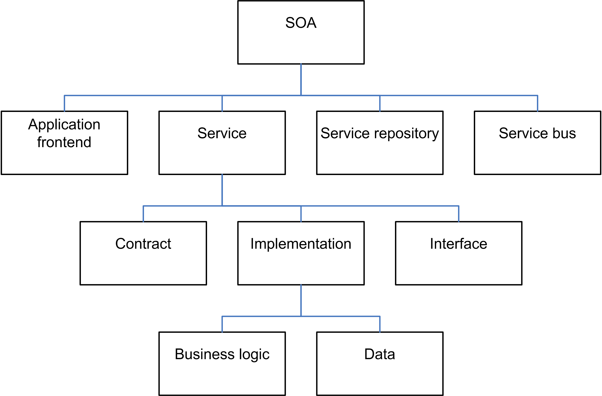

**Service-Oriented Architecture (SOA)** stands for a software design and development model in which individual, existing services can be combined to form a complex software application and it is achieved by communication between the services. The main objective of SOA is to improve performance by assigning different tasks(*parts of a complex task*) to different services and combining their results to form the solution. This SOA model greatly depends on communication between the services. *Services* can be defined as individual working units. That is a service can contain logic that can be specific to a business task or can be composed of smaller sub-services each having further logic to perform their assigned tasks.

   The SOA can be understood by three terminologies:

     *Service Provider
     *Service Registry 
     *Service Requestor

**Service Provider** - The service provider implements the service and makes it available to consumers.

**Service Registry** - This is a logically centralized registry of services. This registry provides a central place where developers register their services or find one for their application.

**Service Requestor** - The Requestor is a consumer of the web service. The requestor searches the services through the registry and finds the service that is best suited for his project and sends a request to the provider.

After the service requestor finds a service he needs for his application in the service repository and he sends a request to the service provider who in response provides the service on a contract basis.

Example: Applications use integrated payment gateways like Paypal, Juspay, etc, instead of creating their own. 

Some of the benefits of using Service Oriented Architecture are:
1. **Loosely coupled** - Each service is built to full fill a particular task. So they are independent of other services in the application.
2. **Reusability** - Since the services are independent, they can be reused for any number of applications without affecting the other services. This cuts down the cost as well as development time.
3. **Scalability** - Further developments in SOA applications are simpler as it is already  a combination of services and adding further services won't be difficult.SOA applications can be modified with easy replacements of services, rapid and low-cost system development by the combination of services.

4. **Easy to Maintain** - If a bug occurs on a particular service,  other services will run as they are independent. So it will be easy to fix the bug in an individual service while the other services are running.

Some of the setbacks to be known are:

**High bandwidth** - Since there will be multiple services changing data over the communication channel the number of messages and data transfers will be high and therefore it affects the performance.

**High overload** - Since all the inputs will be validated before being sent to another service the workload will be high if there are multiple services in the application.

**High cost** - Service Oriented Architecture is costly in terms of human resources, development, and technology.

In conclusion, the application of Service Oriented Architecture methodology improves the performance of the application but it also has certain setbacks to watch out for in the future.

Resources:

  1. A blog on SOA:
         https://medium.com/@SoftwareDevelopmentCommunity/what-is-service-oriented-architecture-fa894d11a7ec

  2. A video on SOA:
  https://youtu.be/jL1oVENiYT8

